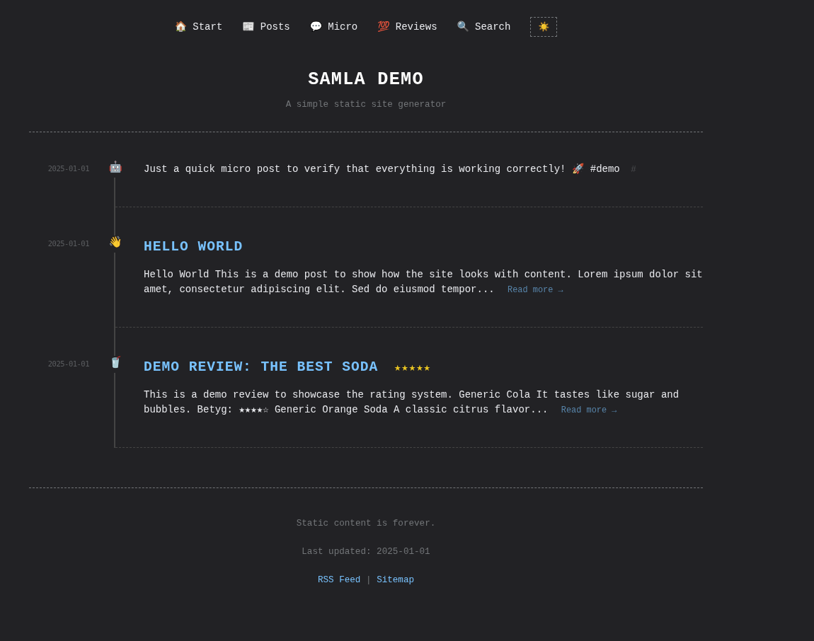

# Custom Static Site Generator

A flexible, Python-based static site generator customized for personal websites. It supports multiple content types (posts, micro-blog, reviews, bookmarks), responsive design, and performance optimizations.



## Table of Contents
- [Features](#features)
- [Installation](#installation)
- [Usage](#usage)
- [Writing Content](#writing-content)
  - [Archetypes](#archetypes)
  - [Shortcode System](#shortcode-system)
- [Configuration](#configuration)
- [Deployment](#deployment)
- [Development](#development)

## Features

-   **Content Types**: Specialized support for Posts, Micro-updates, Reviews (with ratings), and Bookmarks via a Registry Pattern.
-   **Performance**:
    -   **Incremental Builds**: Caches Markdown processing for faster regeneration (`.cache/`).
    -   **Asset Optimization**: Automatic minification of CSS/JS and image resizing/WebP conversion.
-   **Extensibility**:
    -   **Shortcodes**: Plugin system for custom components (e.g., YouTube, Ratings, Spoilers).
    -   **Theming**: Light/Dark mode with persistence.
-   **Search**: Built-in client-side search with a generated JSON index.
-   **SEO**: Automatic sitemap and RSS feed generation.
-   **Deployment**: Ready for **Cloudflare Workers/Pages** with `wrangler.toml` and `package.json` included.

## Installation

1.  **Clone the repository**:
    ```bash
    git clone <repository_url>
    cd <repository_name>
    ```

2.  **Create a virtual environment**:
    ```bash
    python3 -m venv venv
    source venv/bin/activate
    ```

3.  **Install dependencies**:
    ```bash
    pip install -r requirements.txt
    ```

## Usage

The project uses a unified CLI tool `manage.py` for all operations.

## Usage

The project uses `manage.py` as a unified CLI. First, ensure it is executable: `chmod +x manage.py`.

### Commands

#### `build`
Generates the static site.
- `--drafts`: Include posts marked as `draft: true`.
- `--no-cache`: Force a fresh build by clearing the cache.

#### `serve`
Starts a local development server with Live Reload.
- `--port`: Specify a custom port (default: `8000`).

#### `new`
Creates a new post using archetypes.
- `--type`, `-t`: Content type (`posts`, `micro`, `reviews`, `bookmarks`).

#### `clean`
Removes the output directory.

## Writing Content

Content lives in the `content/` directory. It uses Markdown with YAML frontmatter.

### Archetypes
Templates for new content are stored in `archetypes/`. You can customize these to change the default structure for each post type.

### Shortcode System
The generator includes an extensible shortcode system that allows you to embed complex HTML components using simple tags.

#### Usage
Shortcodes use the syntax ``. Both positional and keyword arguments are supported.

#### Available Shortcodes

**YouTube**
Embed a responsive YouTube video.
``

**Rating**
Renders a star rating (e.g., 9.5/10).
``

**Spoiler**
Renders a collapsible block.
```markdown

Hidden content...

```

**Image (`img`)**
Renders a responsive image with optional caption.
``

**Internal Link (`link`)**
Links to another post using its `shortname` defined in frontmatter.
`` or `` (uses post title).


#### Creating New Shortcodes
Add a `.py` file to `generator/shortcodes/` with a `render` function.
Example: `generator/shortcodes/alert.py` -> ``

```python
def render(message, type="info"):
    return f'<div class="alert alert-{type}">{message}</div>'
```

## Configuration

Site settings are located in `config.yaml`.
-   **Site Metadata**: Title, URL, Author, Language (`site.language`).
-   **Navigation**: Menu links configuration.
-   **Humans.txt**: Dynamic generation via `humans:` block (Team, Thanks, Site, Custom).
-   **Data Files**: Support for `data/` directory (accessible via `site.data`).
-   **Root Files**: Support for `files/` directory (copied directly to root).

## Localization / i18n

The site supports full localization via YAML files.

1.  **Configuration**: Set `site.language` in `config.yaml` (e.g., `sv`).
2.  **Locale Files**: Create/Edit `i18n/{language}.yaml` (e.g., `i18n/sv.yaml`).
3.  **UI Strings**: Define key-value pairs in the `strings` block.
4.  **Date Formatting**: Define months, days, and formats in the `date` block.
5.  **Localized URLs**: Map content types to localized URL slugs in the `slugs` block.
    ```yaml
    slugs:
      posts: "inlagg"
      reviews: "recensioner"
    ```
    *Output:* `content/posts/my-post.md` -> `public/inlagg/my-post/index.html`.

## Deployment

### Cloudflare Workers
The project is configured for deployment as a Cloudflare Worker with static assets.

- **Build command**: `python3 manage.py build`
- **Deploy command**: `npx wrangler deploy`
- **Non-production branch deploy command**: `npx wrangler versions upload`

See `wrangler.toml` for configuration details like `compatibility_date` and `assets` directory.

## Development

-   **Live Reload**: `manage.py serve` uses `livereload` to watch for changes and automatically rebuild.
-   **Caching**: Processed Markdown is cached in `.cache/markdown_cache.json`. Use the `--no-cache` flag to force a full rebuild.
-   **Search Index**: The search index `public/search.json` is automatically regenerated on every build.
